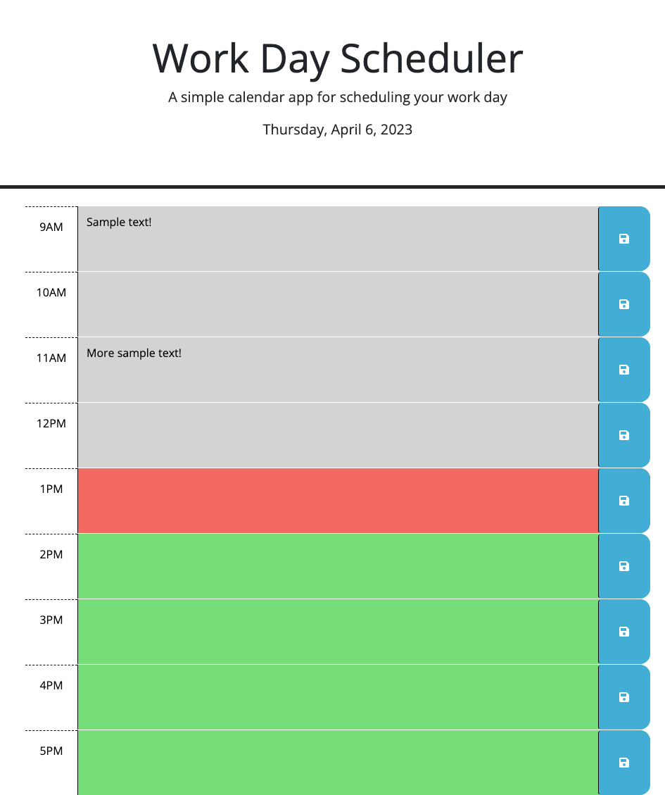

# Workday-Planner

A simple work day planner to plan out your day!

## Description

This web app is designed to act as a simple work day planner. The user can input tasks based on the hour of the day and save their input. Upon page reload, the data will not be lost and will display whatever was last saved. The text boxes will appear as grey if the hour has passed, red if it is the present hour, and green if the hour is in the future.

I found this project fairly straightforward, but I was able to learn a bit more about working with JSON and localStorage. I also began working with arrow functions which was new to me. I struggled to understand the syntax but after watching many videos on the topic, I was able to get the hang of it.

## Installation

Load index.html file to access landing page. CSS styling is external but linked within index.html page.

## Usage

As mentioned above, the usage of this app is very simple.

The general title and the current data is displayed at the top of the page.

The user is to type information on their tasks in the text areas displayed. They will have to click the blue save button for the data to be stored. When the user refreshes the page, the information re-appears based on what was previously saved.

The text boxes also appear as either grey, red, or green based on the time of day. In the example below, the hour is 1PM. The 1PM text box appears as red because it is the present hour. All hours before 1PM are grey because they are in the past, and all hours after 1PM are green because they are in the future.

Page can alternatively be accessed [here](https://nadeemtalaat.github.io/Workday-Planner/).

## Credits

- Nadeem Talaat
- Source code provided by UofT Coding Bootcamp.

## License

[MIT](https://choosealicense.com/licenses/mit/)
